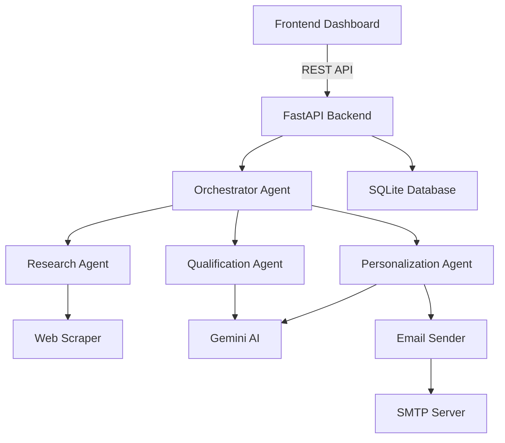

# 🤖 AI Sales Agent

> An intelligent, AI-powered lead generation and outreach automation system built with FastAPI, LangChain, and Google Gemini.

[](https://www.python.org/downloads/)
[](https://fastapi.tiangolo.com/)
[](https://langchain.com/)
[](LICENSE)

## 📋 Table of Contents

- [Overview](#-overview)
- [Features](#-features)
- [Architecture](#-architecture)
- [Tech Stack](#-tech-stack)
- [Getting Started](#-getting-started)
- [Configuration](#-configuration)
- [Usage](#-usage)
- [API Documentation](#-api-documentation)
- [Roadmap](#-roadmap)
- [Contributing](#-contributing)
- [License](#-license)

## 🎯 Overview

**AI Sales Agent** is a comprehensive lead generation and email outreach automation platform that leverages AI to:

- 🔍 **Research** potential leads based on industry, location, and company size
- ✅ **Qualify** leads using intelligent scoring algorithms
- ✉️ **Personalize** outreach emails with AI-generated content
- 📧 **Automate** email campaigns with tracking and analytics
- 📊 **Analyze** campaign performance with detailed metrics

Perfect for sales teams, growth hackers, and businesses looking to scale their outbound sales efforts.

## ✨ Features

### Core Functionality

- **Multi-Agent AI System**
  - Research Agent: Discovers potential leads through web scraping
  - Qualification Agent: Scores and filters high-quality prospects
  - Personalization Agent: Generates tailored email content using Gemini AI
  - Orchestrator Agent: Manages the complete workflow

- **Email Automation**
  - SMTP integration (Gmail, Outlook, custom servers)
  - HTML & plain text email templates
  - Automatic unsubscribe link generation
  - Email validation and verification

- **Campaign Management**
  - Create and manage multiple campaigns
  - Target criteria customization
  - Real-time campaign statistics
  - Lead tracking and status management

- **Modern Dashboard**
  - Beautiful, responsive UI built with Tailwind CSS
  - Real-time campaign metrics
  - Lead management interface
  - Campaign creation wizard

### Current Capabilities

✅ Lead research and discovery  
✅ AI-powered lead qualification  
✅ Personalized email generation  
✅ Automated email sending  
✅ Campaign analytics  
✅ Unsubscribe management  
✅ RESTful API  

## 🏗️ Architecture



### Agent Workflow

1. **Research Phase**: Discovers companies matching target criteria
2. **Qualification Phase**: Scores leads and identifies pain points
3. **Personalization Phase**: Generates customized email content
4. **Outreach Phase**: Sends emails and tracks engagement

## 🛠️ Tech Stack

### Backend
- **FastAPI** - Modern, high-performance web framework
- **LangChain** - AI agent orchestration framework
- **LangGraph** - Workflow management for AI agents
- **Google Gemini** - AI model for content generation
- **SQLAlchemy** - ORM for database operations
- **Playwright** - Web scraping and automation
- **aiosmtplib** - Async email sending

### Frontend
- **HTML5/CSS3** - Modern web standards
- **Tailwind CSS** - Utility-first CSS framework
- **Alpine.js** - Lightweight JavaScript framework
- **Vanilla JavaScript** - No heavy frameworks

### Database
- **SQLite** - Lightweight, serverless database (easily upgradable to PostgreSQL)

## 🚀 Getting Started

### Prerequisites

- Python 3.9 or higher
- Gmail account (for SMTP) or other email provider
- Google Gemini API key ([Get one here](https://makersuite.google.com/app/apikey))

### Installation

1. **Clone the repository**
   ```bash
   git clone https://github.com/yourusername/ai-sales-agent.git
   cd ai-sales-agent
   ```

2. **Create virtual environment**
   ```bash
   python -m venv venv
   
   # Windows
   venv\Scripts\activate
   
   # Linux/Mac
   source venv/bin/activate
   ```

3. **Install dependencies**
   ```bash
   cd backend
   pip install -r requirements.txt
   ```

4. **Install Playwright browsers**
   ```bash
   playwright install
   ```

5. **Configure environment variables**
   ```bash
   cp .env.example .env
   # Edit .env with your credentials (see Configuration section)
   ```

6. **Run the application**
   ```bash
   # Start backend server
   cd backend
   python -m app.main
   
   # Open frontend (in another terminal)
   cd frontend
   # Open index.html in your browser or use a local server
   python -m http.server 8080
   ```

7. **Access the application**
   - Frontend: `http://localhost:8080`
   - Backend API: `http://localhost:8000`
   - API Docs: `http://localhost:8000/docs`

## ⚙️ Configuration

### Environment Variables

Edit `backend/.env` with your credentials:

```env
# Gemini API
GEMINI_API_KEY=your-gemini-api-key-here
GEMINI_MODEL=gemini-2.5-flash

# Email (Gmail SMTP)
SMTP_HOST=smtp.gmail.com
SMTP_PORT=587
SMTP_USER=your-email@gmail.com
SMTP_PASSWORD=your-gmail-app-password
SMTP_FROM_EMAIL=your-email@gmail.com
SMTP_FROM_NAME=AI Sales Agent

# Database
DATABASE_URL=sqlite+aiosqlite:///./data/sales_agent.db

# App Settings
DEBUG=True
ENVIRONMENT=development
```

### Gmail Setup

For detailed Gmail SMTP setup instructions, see [GMAIL_SETUP_GUIDE.md](GMAIL_SETUP_GUIDE.md)

**Quick steps:**
1. Enable 2-Factor Authentication on your Google account
2. Generate an App Password
3. Use the App Password in `SMTP_PASSWORD`

## 📖 Usage

### Creating a Campaign

1. Open the dashboard at `http://localhost:8080`
2. Click "Create New Campaign"
3. Fill in campaign details:
   - Campaign Name
   - Target Industry
   - Location (optional)
   - Company Size (optional)
4. Click "Create Campaign"
5. Click "Run Campaign" to start the workflow

### API Usage

```python
import httpx

# Create a campaign
async with httpx.AsyncClient() as client:
    response = await client.post(
        "http://localhost:8000/api/v1/campaigns/",
        json={
            "name": "SaaS Outreach Q1",
            "target_criteria": {
                "industry": "SaaS",
                "location": "USA",
                "company_size": "50-200"
            }
        }
    )
    campaign = response.json()
    
    # Run the campaign
    run_response = await client.post(
        f"http://localhost:8000/api/v1/campaigns/{campaign['id']}/run"
    )
    print(run_response.json())
```

## 📚 API Documentation

Once the server is running, visit:
- **Swagger UI**: `http://localhost:8000/docs`
- **ReDoc**: `http://localhost:8000/redoc`

### Key Endpoints

- `POST /api/v1/campaigns/` - Create a new campaign
- `GET /api/v1/campaigns/` - List all campaigns
- `GET /api/v1/campaigns/{id}` - Get campaign details
- `POST /api/v1/campaigns/{id}/run` - Execute campaign
- `GET /api/v1/campaigns/{id}/stats` - Get campaign statistics
- `GET /api/v1/leads/` - List all leads
- `POST /api/v1/unsubscribe/{token}` - Unsubscribe endpoint

## 🗺️ Roadmap

### Version 1.1 (Planned)
- [ ] Email open tracking with pixels
- [ ] Link click tracking
- [ ] Reply detection via Gmail API
- [ ] Rate limiting for email sending
- [ ] Bounce handling

### Version 1.2 (Planned)
- [ ] Automated follow-up sequences
- [ ] Celery integration for background tasks
- [ ] Email validation API integration (Hunter.io)
- [ ] A/B testing for subject lines

### Version 2.0 (Future)
- [ ] Docker & Docker Compose support
- [ ] PostgreSQL support
- [ ] Advanced analytics dashboard
- [ ] CRM integrations (HubSpot, Salesforce)
- [ ] Multi-user support with authentication
- [ ] Webhook support for real-time events

## 🤝 Contributing

Contributions are welcome! This project is in active development.

### How to Contribute

1. Fork the repository
2. Create a feature branch (`git checkout -b feature/amazing-feature`)
3. Commit your changes (`git commit -m 'Add amazing feature'`)
4. Push to the branch (`git push origin feature/amazing-feature`)
5. Open a Pull Request

### Development Setup

```bash
# Install development dependencies
pip install -r requirements.txt
pip install pytest pytest-asyncio black flake8

# Run tests
pytest

# Format code
black .

# Lint code
flake8 .
```

## 📝 License

This project is licensed under the MIT License - see the [LICENSE](LICENSE) file for details.

## 🙏 Acknowledgments

- [FastAPI](https://fastapi.tiangolo.com/) - Amazing web framework
- [LangChain](https://langchain.com/) - AI orchestration
- [Google Gemini](https://deepmind.google/technologies/gemini/) - Powerful AI model
- [Tailwind CSS](https://tailwindcss.com/) - Beautiful styling

## 📧 Contact

**Developer:** Jana Ashraf Elpardisi

- 📧 Email: [janaelpardisi@gmail.com](mailto:janaelpardisi@gmail.com)
- 💼 LinkedIn: [Jana Ashraf Elpardisi](https://www.linkedin.com/in/jana-ashraf-elpardisi)
- 🐙 GitHub: [@Janaelpardisi](https://github.com/Janaelpardisi)

For questions, support, or collaboration opportunities, feel free to reach out!

---

**⚠️ Disclaimer**: This tool is for legitimate business outreach only. Always comply with email marketing laws (CAN-SPAM, GDPR, etc.) and respect unsubscribe requests.

**Made with ❤️ and AI**
